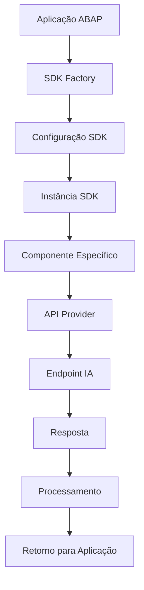

# Microsoft AI SDK para SAP ABAP - Demonstração v2.0

## 🇧🇷 Documentação em Português

Este repositório contém exemplos e demonstrações do **Microsoft AI SDK para SAP ABAP versão 2.0**, um kit de desenvolvimento de software (SDK) projetado para fornecer aos desenvolvedores SAP ABAP as ferramentas necessárias para criar aplicações empresariais inteligentes usando tecnologias de inteligência artificial (IA).

### 🗂️ Índice da Documentação

| Documento | Descrição | Nível |
|-----------|-----------|-------|
| **[README_PT-BR.md](README_PT-BR.md)** | 📖 Documentação principal em português | Iniciante |
| **[INSTALACAO.md](INSTALACAO.md)** | 🔧 Guia completo de instalação e configuração | Iniciante |
| **[EXEMPLOS.md](EXEMPLOS.md)** | 💻 Exemplos práticos com código comentado | Intermediário |
| **[ARQUITETURA.md](ARQUITETURA.md)** | 🏗️ Documentação técnica da arquitetura | Avançado |
| **[TROUBLESHOOTING.md](TROUBLESHOOTING.md)** | 🆘 Solução de problemas e FAQ | Todos os níveis |

### 📚 Links Importantes
- **[Documentação Oficial do Microsoft AI SDK para SAP](https://microsoft.github.io/aisdkforsapabap/)**
- **[Fórum de Discussão](https://github.com/microsoft/aisdkforsapabap/discussions)**
- **[Relatório de Issues/Bugs](https://github.com/microsoft/aisdkforsapabap/issues)**

### 📖 Documentação Detalhada (em Português)
- **[🔧 Guia de Instalação e Configuração](INSTALACAO.md)** - Instruções passo a passo para instalação
- **[💻 Exemplos Práticos de Código](EXEMPLOS.md)** - Códigos comentados e casos de uso
- **[🏗️ Documentação de Arquitetura](ARQUITETURA.md)** - Estrutura técnica e padrões de design
- **[🆘 Guia de Solução de Problemas](TROUBLESHOOTING.md)** - FAQ e troubleshooting

---

## 🎯 O que é o Microsoft AI SDK para SAP?

O **Microsoft AI SDK para SAP ABAP** é um SDK abrangente e amigável para desenvolvedores, com uma interface intuitiva que permite integrar facilmente recursos de IA em aplicações ABAP. O SDK oferece suporte para múltiplos mecanismos de IA e foi projetado para simplificar a integração de tecnologias avançadas de inteligência artificial em processos empresariais SAP.

### ✨ Características Principais
- **Interface Intuitiva**: Fácil de usar para desenvolvedores ABAP
- **Múltiplos Provedores de IA**: Suporte para Azure OpenAI e OpenAI
- **Integração Nativa**: Desenvolvido especificamente para ambiente SAP ABAP
- **Exemplos Práticos**: Demonstrações completas de uso
- **Arquitetura Modular**: Componentes organizados e reutilizáveis

---

## 🤖 Mecanismos de IA Suportados

### 🔵 Azure OpenAI
Azure OpenAI é um conjunto abrangente de serviços e ferramentas de IA fornecidos pela Microsoft Azure. Inclui algoritmos poderosos de machine learning, ferramentas de processamento de linguagem natural e serviços cognitivos que podem ser usados para construir aplicações inteligentes capazes de:

- Reconhecer padrões
- Processar linguagem natural
- Fazer previsões baseadas em dados
- Modelos de IA pré-construídos e algoritmos
- Ferramentas para treinamento e deployment de modelos personalizados

**[Segurança, Conformidade e Privacidade de Dados do Azure OpenAI](https://learn.microsoft.com/pt-br/legal/cognitive-services/openai/data-privacy)**

### 🟢 OpenAI
OpenAI é uma organização de pesquisa em inteligência artificial que visa criar IA segura e benéfica para a humanidade. A OpenAI conduz pesquisas de ponta em tópicos como modelos generativos, processamento de linguagem natural, visão computacional e aprendizado por reforço. Também desenvolve produtos e plataformas que permitem acesso e uso de seus modelos de IA, como a API OpenAI e ChatGPT.

---

## 📁 Estrutura do Repositório

### 🗂️ Organização dos Pacotes ABAP

```
src/
└── zpengg_ai_openai_main/                    # 📦 Pacote Principal
    ├── package.devc.xml
    ├── zpengg_ai_openai/                     # 🔄 Implementação OpenAI
    │   ├── zpengg_oai_demos/                 # 🎯 Programas de Demonstração
    │   ├── zpengg_oai_sdk_core/              # 🔧 Núcleo do SDK OpenAI
    │   └── zpengg_oai_sdk_v1/                # 📊 SDK OpenAI v1
    ├── zpengg_ai_openai_azure/               # ☁️ Implementação Azure OpenAI
    │   └── zpengg_ai_openai_azure_sdk/       # 🛠️ SDK Azure OpenAI
    │       └── zpengg_azoai_sdk_core/        # ⚙️ Núcleo Azure OpenAI
    └── zpengg_ai_openai_utils/               # 🔨 Utilitários Compartilhados
```

### 📈 Estatísticas do Código
- **21 Programas ABAP** de demonstração e exemplo
- **31 Classes ABAP** implementando funcionalidades do SDK
- **Múltiplas Interfaces** para extensibilidade e padronização

---

## 🎮 Programas de Demonstração

O repositório inclui diversos programas de demonstração localizados no pacote `zpengg_oai_demos`:

### 🗨️ Chat Completion (Conversação)
**Programa**: `ZP_AISDKDEMO_CHTCMPL_SMPL_OAI`
- **Funcionalidade**: Demonstra como usar chat completion com roles de sistema e usuário
- **Exemplo**: Cria um assistente especialista em ABAP que pode gerar código

### 📝 Text Completion (Completamento de Texto)
**Programa**: `ZP_MSAISDKDEMO_COMPLETION_OAI`
- **Funcionalidade**: Interface gráfica para completamento de texto
- **Características**: Interface com campos de entrada e saída, configuração de parâmetros

### 🧠 Embeddings (Representações Vetoriais)
**Programa**: `ZP_AISDKDEMO_EMBEDDINGS_OAI`
- **Funcionalidade**: Demonstra como criar embeddings para análise semântica de texto

### 📊 Modelos e Configurações
**Programa**: `ZP_MSAISDKDEMO_MODELS_OAI`
- **Funcionalidade**: Lista e explora modelos disponíveis

### 🎛️ Configuração de Parâmetros
**Programa**: `ZP_MSAISDKDEMO_PARAMS_TOP_OAI`
- **Funcionalidade**: Parâmetros comuns para configuração do SDK (endpoint, versão, chave de API)

### 📁 Gerenciamento de Arquivos
**Programa**: `ZP_MSAISDKDEMO_FILES_OAI`
- **Funcionalidade**: Upload e gerenciamento de arquivos para IA

### 🎯 Fine-tuning
**Programa**: `ZP_MSAISDKDEMO_FINETUNES_OAI`
- **Funcionalidade**: Demonstra processos de fine-tuning de modelos

---

## 🔧 Classes Principais do SDK

### 🏭 Factory Classes (Classes Fábrica)
- **`ZCL_PENG_AZOAI_SDK_FACTORY`**: Fábrica principal para criar instâncias do SDK Azure OpenAI
- **`ZCL_PENG_OAI_SDK_FACTORY`**: Fábrica para SDK OpenAI

### 🎯 Componentes Principais
- **`ZCL_PENG_OAI_SDK_V1_CHATCOMPL`**: Implementação de chat completion
- **`ZCL_PENG_OAI_SDK_V1_COMPLET`**: Implementação de text completion
- **`ZCL_PENG_OAI_SDK_V1_EMBEDING`**: Implementação de embeddings

### 🌐 Provedores de URL e Configuração
- **`ZCL_PENG_OAI_URLPROVIDER`**: Gerencia URLs e endpoints
- **`ZCL_PENG_AZOAI_URLPROVIDER`**: Provedor de URLs para Azure OpenAI
- **`ZCL_PENG_AZOAI_SDK_CONFIG_BASE`**: Configuração base do Azure OpenAI

### 🔗 Interfaces Principais
- **`ZIF_PENG_AZOAI_SDK_TYPES`**: Definições de tipos para Azure OpenAI
- **`ZIF_PENG_AZOAI_SDK_CONSTANTS`**: Constantes do SDK
- **`ZIF_PENG_OAI_SDK_CONSTANTS`**: Constantes para OpenAI

---

## 🚀 Guia de Instalação e Configuração

### 📋 Pré-requisitos
1. **Sistema SAP**: Sistema SAP com suporte ABAP
2. **abapGit**: Para importação do código
3. **Chave de API**: Azure OpenAI ou OpenAI API key
4. **Conectividade**: Acesso HTTPS para endpoints de IA

### 🛠️ Instalação

1. **Clone/Download do Repositório**
   ```bash
   git clone https://github.com/marcosoikawa/aisdkforsapabap-demo.git
   ```

2. **Importação via abapGit**
   - Abra abapGit no seu sistema SAP
   - Crie um novo repositório online
   - Use a URL do repositório
   - Importe todos os objetos para o pacote `ZPENGG_AI_OPENAI_MAIN`

3. **Configuração de Conectividade**
   - Configure o sistema SAP para permitir conexões HTTPS
   - Configure certificados SSL se necessário
   - Teste conectividade com endpoints de IA

### ⚙️ Configuração

#### Para Azure OpenAI:
```abap
" Parâmetros necessários
p_url = 'https://your-resource.openai.azure.com/' " Endpoint do Azure
p_ver = '2023-05-15'                               " Versão da API
p_key = 'sua-chave-api'                           " Chave de API
```

#### Para OpenAI:
```abap
" Parâmetros necessários
p_url = 'https://api.openai.com/v1/'              " Endpoint OpenAI
p_ver = 'v1'                                      " Versão
p_key = 'sk-sua-chave-api'                       " Chave de API
```

---

## 💻 Exemplos de Código

### 🗨️ Exemplo de Chat Completion

```abap
" Criar instância do SDK
sdk_instance = zcl_peng_azoai_sdk_factory=>get_instance( )->get_sdk(
  api_version = p_ver
  api_base    = p_url
  api_type    = zif_peng_azoai_sdk_constants=>c_apitype-openai
  api_key     = p_key
).

" Construir prompt com roles de sistema e usuário
APPEND INITIAL LINE TO chatcompl_input-messages ASSIGNING FIELD-SYMBOL(<fs_message>).
<fs_message>-role = zif_peng_azoai_sdk_constants=>c_chatcompletion_role-system.
<fs_message>-content = |Você é um especialista em desenvolvimento ABAP|.

APPEND INITIAL LINE TO chatcompl_input-messages ASSIGNING <fs_message>.
<fs_message>-role = zif_peng_azoai_sdk_constants=>c_chatcompletion_role-user.
<fs_message>-content = |Escreva um programa ABAP que obtenha dados de uma tabela personalizada|.

" Executar chat completion
sdk_instance->chat_completions( )->create(
  EXPORTING
    deploymentid = 'gpt-35-turbo'
    prompts      = chatcompl_input
  IMPORTING
    statuscode   = status_code
    statusreason = status_reason
    json         = returnjson
    response     = chatcompl_output
    error        = error
).
```

### 📝 Exemplo de Text Completion

```abap
" Configurar entrada para completion
completions_input-prompt = 'Complete este código ABAP: DATA: lv_texto TYPE string.'.
completions_input-max_tokens = 150.
completions_input-temperature = '0.7'.

" Executar completion
sdk_instance->completions( )->create(
  EXPORTING
    deploymentid = 'text-davinci-003'
    prompts      = completions_input
  IMPORTING
    statuscode   = status_code
    response     = completions_output
).
```

### 🧠 Exemplo de Embeddings

```abap
" Configurar texto para embedding
embedding_input-input = 'Este é um texto para análise semântica'.

" Gerar embedding
sdk_instance->embeddings( )->create(
  EXPORTING
    deploymentid = 'text-embedding-ada-002'
    prompts      = embedding_input
  IMPORTING
    statuscode   = status_code
    response     = embedding_output
).
```

---

## 🏗️ Arquitetura do SDK

### 📊 Padrões de Arquitetura Utilizados

1. **Factory Pattern**: Para criação de instâncias do SDK
2. **Strategy Pattern**: Para diferentes provedores de IA (Azure/OpenAI)
3. **Template Method**: Para operações comuns de IA
4. **Dependency Injection**: Para configuração flexível

### 🔄 Fluxo de Execução



### 🛡️ Tratamento de Erros

O SDK implementa um sistema robusto de tratamento de erros:
- **`ZCX_PENG_AZOAI_SDK_EXCEPTION`**: Classe de exceção específica
- **Códigos de Status HTTP**: Mapeamento de erros HTTP
- **Logs Detalhados**: Para debugging e monitoramento

---

## 🔒 Segurança e Boas Práticas

### 🛡️ Segurança
1. **Chaves de API**: Nunca hardcode chaves no código
2. **HTTPS**: Sempre use conexões seguras
3. **Validação**: Valide entradas e saídas
4. **Logs**: Não registre informações sensíveis

### 📝 Boas Práticas
1. **Gestão de Recursos**: Gerencie instâncias do SDK adequadamente
2. **Rate Limiting**: Respeite limites da API
3. **Error Handling**: Implemente tratamento robusto de erros
4. **Testing**: Teste em ambiente não-produtivo primeiro

---

## 🔄 Casos de Uso Empresariais

### 📋 Automação de Processos
- **Classificação de Documentos**: Usando embeddings para categorização
- **Geração de Relatórios**: Criação automática de resumos
- **Análise de Sentimento**: Em feedback de clientes

### 🤖 Assistentes Inteligentes
- **Help Desk**: Respostas automáticas a perguntas comuns
- **Assistente de Código**: Geração de código ABAP
- **Documentação**: Geração automática de documentação

### 📊 Análise de Dados
- **Insights de Dados**: Análise inteligente de dados empresariais
- **Previsões**: Modelos preditivos para business intelligence
- **Análise de Texto**: Processamento de documentos não estruturados

---

## 🐛 Solução de Problemas

### ❗ Problemas Comuns

#### 🔑 Erro de Autenticação
```
Solução: Verifique se a chave API está correta e não expirou
```

#### 🌐 Erro de Conectividade
```
Solução: Verifique configurações de proxy e certificados SSL
```

#### 📊 Limite de Rate
```
Solução: Implemente retry logic e respeite limites da API
```

#### 🏗️ Erro de Configuração
```
Solução: Verifique parâmetros de endpoint e versão da API
```

### 🔍 Debug e Logging

Ative logs detalhados para debugging:
```abap
" Configurar logging detalhado
sdk_instance->set_debug_mode( abap_true ).
```

---

## 🤝 Contribuição

Este projeto está atualmente em desenvolvimento ativo. Sugestões e solicitações de recursos são muito bem-vindas!

### 📬 Como Contribuir
1. **Fórum de Discussão**: Use o [fórum](https://github.com/microsoft/aisdkforsapabap/discussions) para trocar ideias
2. **Issues**: Relate bugs ou solicite recursos via [issues](https://github.com/microsoft/aisdkforsapabap/issues)
3. **Feedback**: Compartilhe sua experiência e casos de uso

### 🔮 Roadmap Futuro
- Contribuições da comunidade serão aceitas no futuro
- Novos provedores de IA podem ser adicionados
- Expansão de funcionalidades baseada em feedback

---

## 📜 Licença

Este projeto está licenciado sob a **Licença MIT** - veja o arquivo [LICENSE](LICENSE) para detalhes.

### 📋 Termos Importantes
- **Uso Comercial**: Permitido
- **Modificação**: Permitida
- **Distribuição**: Permitida
- **Uso Privado**: Permitido

---

## 🏢 Informações Legais e Marcas Registradas

Este projeto pode conter marcas registradas ou logotipos de projetos, produtos ou serviços. O uso autorizado de marcas registradas ou logotipos da Microsoft está sujeito e deve seguir as [Diretrizes de Marcas Registradas da Microsoft](https://www.microsoft.com/pt-br/legal/intellectualproperty/trademarks/usage/general).

O uso de marcas registradas ou logotipos da Microsoft em versões modificadas deste projeto não deve causar confusão ou implicar patrocínio da Microsoft. Qualquer uso de marcas registradas ou logotipos de terceiros está sujeito às políticas desses terceiros.

---

## 🆘 Suporte e Documentação Adicional

### 📚 Recursos Adicionais
- **[Documentação Oficial](https://microsoft.github.io/aisdkforsapabap/)**: Documentação técnica completa
- **[Samples e Exemplos](https://github.com/microsoft/aisdkforsapabap)**: Repositório principal com mais exemplos
- **[Azure OpenAI Documentation](https://docs.microsoft.com/azure/cognitive-services/openai/)**: Documentação oficial do Azure OpenAI

### 💬 Comunidade
- **[GitHub Discussions](https://github.com/microsoft/aisdkforsapabap/discussions)**: Discussões da comunidade
- **[Stack Overflow](https://stackoverflow.com/questions/tagged/sap-abap+openai)**: Tag: `sap-abap` + `openai`

---

## 📊 Métricas e Status

### 🎯 Estado do Projeto
- **Versão Atual**: 2.0
- **Status**: Em Desenvolvimento Ativo
- **Última Atualização**: 2024
- **Linguagem Principal**: ABAP

### 📈 Estatísticas
- **21 Programas** de demonstração
- **31 Classes** implementadas
- **Múltiplas Interfaces** para extensibilidade
- **Suporte Completo** para Azure OpenAI e OpenAI

---

*Desenvolvido com ❤️ pela equipe Microsoft Platform Engineering para a comunidade SAP ABAP*

**[⬆️ Voltar ao Topo](#microsoft-ai-sdk-para-sap-abap---demonstração-v20)**