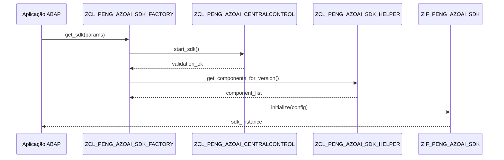
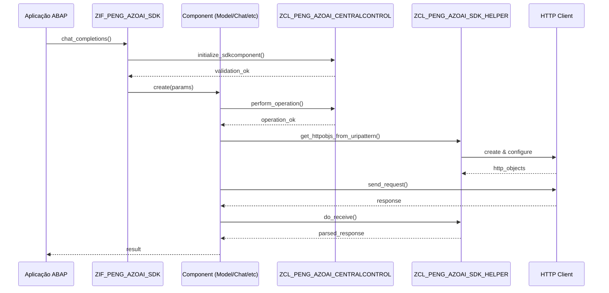

# Arquitetura Técnica - ZPENGG_AZOAI_SDK_CORE

## 📐 Visão Geral da Arquitetura

O SDK foi projetado seguindo princípios de arquitetura moderna, com foco em modularidade, extensibilidade e manutenibilidade.

## 🏗️ Padrões de Design Utilizados

### 1. Factory Pattern
**Implementação**: `ZCL_PENG_AZOAI_SDK_FACTORY`

```abap
" Singleton Factory - Ponto único de criação
DATA(sdk) = zcl_peng_azoai_sdk_factory=>get_instance( )->get_sdk(
  api_version = '2023-05-15'
  api_base    = 'https://endpoint.openai.azure.com'
  api_type    = 'azure'
  api_key     = 'key'
).
```

**Benefícios**:
- Controle centralizado de criação de objetos
- Facilita testes e mocking
- Permite validação de parâmetros antes da criação

### 2. Template Method Pattern
**Implementação**: `ZCL_PENG_AZOAI_SDK_BASE`

```abap
" Classe abstrata define estrutura comum
CLASS zcl_peng_azoai_sdk_base DEFINITION ABSTRACT.
  " Métodos abstratos implementados pelas subclasses
  " Comportamento comum definido na classe base
ENDCLASS.
```

### 3. Strategy Pattern
**Implementação**: Diferentes classes para diferentes versões de API

```abap
" Diferentes estratégias para diferentes versões
" zcl_peng_azoai_sdk_v2022_12_01
" zcl_peng_azoai_sdk_v2023_05_15
" zcl_peng_azoai_sdk_v2023_08_01_preview
```

### 4. Facade Pattern
**Implementação**: `ZIF_PENG_AZOAI_SDK`

```abap
" Interface unificada para todas as funcionalidades
sdk->model( )          " Acesso aos modelos
sdk->deployments( )    " Acesso aos deployments
sdk->completions( )    " Acesso às completions
sdk->chat_completions( ) " Acesso aos chats
```

## 🔧 Componentes Detalhados

### Core Components

```
ZIF_PENG_AZOAI_SDK (Interface Principal)
├── model()
│   └── ZIF_PENG_AZOAI_SDK_COMP_MODEL
│       ├── list()
│       └── get()
├── deployments()
│   └── ZIF_PENG_AZOAI_SDK_COMP_DEPLOY
│       ├── create()
│       ├── list()
│       ├── get()
│       └── delete()
├── completions()
│   └── ZIF_PENG_AZOAI_SDK_COMP_COMPL
│       └── create()
├── chat_completions()
│   └── ZIF_PENG_AI_SDK_COMP_CHATCOMPL
│       └── create()
├── files()
│   └── ZIF_PENG_AZOAI_SDK_COMP_FILES
│       ├── upload()
│       ├── import()
│       ├── list()
│       ├── get()
│       ├── get_content()
│       └── delete()
├── finetunes()
│   └── ZIF_PENG_AZOAI_SDK_COMP_FINTUN
│       ├── create()
│       ├── list()
│       ├── get()
│       ├── get_events()
│       ├── cancel()
│       └── delete()
└── embeddings()
    └── ZIF_PENG_AZOAI_SDK_COMP_EMBED
        └── create()
```

### Support Components

#### 1. Configuration System
```abap
ZIF_PENG_AZOAI_SDK_CONFIG
├── get_apibase()      " URL base da API
├── get_apiversion()   " Versão da API
├── get_apitype()      " Tipo: azure/openai
├── get_authheader()   " Headers de autenticação
└── get_single_parameter() " Parâmetros adicionais
```

#### 2. Helper System
```abap
ZCL_PENG_AZOAI_SDK_HELPER (Singleton)
├── get_components_for_version()    " Componentes por versão
├── get_httpobjs_from_uripattern() " Objetos HTTP
├── do_receive()                   " Processar resposta
└── raise_feature_notimpl_ex()     " Exceção não implementado
```

#### 3. Central Control
```abap
ZCL_PENG_AZOAI_CENTRALCONTROL
├── start_sdk()                    " Validar início do SDK
├── initialize_sdkcomponent()      " Validar componente
└── perform_operation()            " Validar operação
```

## 🔄 Fluxo de Execução

### 1. Inicialização do SDK



### 2. Execução de Operação



## 🗂️ Estrutura de Tipos

### Core Data Types

```abap
" Tipos principais definidos em ZIF_PENG_AZOAI_SDK_TYPES
TYPES:
  " Chat Completion
  BEGIN OF ty_chatcompletion_input,
    messages          TYPE TABLE OF ty_chatmessage,
    max_tokens        TYPE i,
    temperature       TYPE string,
    top_p            TYPE string,
    n                TYPE i,
    stream           TYPE abap_bool,
    stop             TYPE string,
    presence_penalty TYPE string,
    frequency_penalty TYPE string,
  END OF ty_chatcompletion_input,

  " Chat Message
  BEGIN OF ty_chatmessage,
    role    TYPE string,  " system/user/assistant
    content TYPE string,
  END OF ty_chatmessage,

  " Model Information
  BEGIN OF ty_model_get,
    id               TYPE string,
    object           TYPE string,
    created_at       TYPE i,
    owned_by         TYPE string,
    status           TYPE string,
    capabilities     TYPE ty_int_mod_get_capabilities,
    lifecycle_status TYPE string,
    model            TYPE string,
  END OF ty_model_get.
```

### Error Handling Types

```abap
" Tratamento de erros padronizado
TYPES:
  BEGIN OF ty_error,
    error TYPE BEGIN OF error_detail,
      code    TYPE string,
      message TYPE string,
      param   TYPE string,
      type    TYPE string,
    END OF error_detail,
  END OF ty_error.
```

## 🔒 Segurança e Controle

### 1. Central Control System
O sistema de controle central permite implementar políticas organizacionais:

```abap
CLASS zcl_peng_azoai_centralcontrol IMPLEMENTATION.
  METHOD zif_peng_azoai_centralcontrol~start_sdk.
    " Implementar validações:
    " - Usuário autorizado?
    " - Ambiente permitido?
    " - Horário de funcionamento?
    " - Quota disponível?
  ENDMETHOD.

  METHOD zif_peng_azoai_centralcontrol~perform_operation.
    " Implementar controles por operação:
    " - Operação permitida para este usuário?
    " - Dados sensíveis sendo enviados?
    " - Logs de auditoria
  ENDMETHOD.
ENDCLASS.
```

### 2. Authentication Strategies

```abap
" Suporte a múltiplos tipos de autenticação
CONSTANTS:
  BEGIN OF c_apitype,
    azure    TYPE string VALUE 'azure',     " API Key Azure OpenAI
    azure_ad TYPE string VALUE 'azure_ad',  " Azure AD Token
    openai   TYPE string VALUE 'openai',    " OpenAI API Key
  END OF c_apitype.
```

## 🔄 Extensibilidade

### 1. Adicionando Nova Versão de API

```abap
" 1. Definir nova versão em constantes
CONSTANTS:
  c_versions-v_2024_01_01 TYPE string VALUE '2024-01-01'.

" 2. Criar classe implementação
CLASS zcl_peng_azoai_sdk_v2024_01_01 DEFINITION
  INHERITING FROM zcl_peng_azoai_sdk_base.
  " Implementar métodos específicos da versão
ENDCLASS.

" 3. Registrar no helper
METHOD get_components_for_version.
  CASE api_version.
    WHEN '2024-01-01'.
      " Retornar componentes para nova versão
  ENDCASE.
ENDMETHOD.
```

### 2. Adicionando Novo Componente

```abap
" 1. Definir interface do componente
INTERFACE zif_peng_azoai_sdk_comp_newfeature.
  METHODS: new_operation
    IMPORTING params TYPE ty_new_params
    EXPORTING result TYPE ty_new_result.
ENDINTERFACE.

" 2. Implementar classe base
CLASS zcl_peng_azoai_sdk_newfeature_base DEFINITION
  ABSTRACT
  INHERITING FROM zcl_peng_azoai_sdk_component.
ENDCLASS.

" 3. Adicionar ao SDK principal
INTERFACE zif_peng_azoai_sdk.
  METHODS: new_feature
    RETURNING VALUE(component) TYPE REF TO zif_peng_azoai_sdk_comp_newfeature.
ENDINTERFACE.
```

## 📊 Performance e Otimização

### 1. Connection Pooling
O SDK reutiliza conexões HTTP quando possível:

```abap
" Helper mantém conexões ativas
CLASS zcl_peng_azoai_sdk_helper IMPLEMENTATION.
  METHOD get_httpobjs_from_uripattern.
    " Reutilizar conexões existentes quando possível
    " Configurar timeouts apropriados
    " Implementar retry com backoff
  ENDMETHOD.
ENDCLASS.
```

### 2. Caching
Implementação de cache para operações frequentes:

```abap
" Cache de modelos e deployments
" Evita chamadas desnecessárias à API
" TTL configurável por tipo de recurso
```

### 3. Monitoring
```abap
" Logs estruturados para monitoramento
" Métricas de performance
" Tracking de uso de tokens
" Alertas de rate limiting
```

## 🧪 Testabilidade

### 1. Mock Support
```abap
" Interfaces permitem fácil mocking
DATA: mock_sdk TYPE REF TO zif_peng_azoai_sdk.
" Implementar mock para testes unitários
```

### 2. Test Utilities
```abap
" Utilitários para criar dados de teste
" Simulação de respostas da API
" Validação de chamadas HTTP
```

---

**Princípios Arquiteturais**:
- **Single Responsibility**: Cada classe tem uma responsabilidade clara
- **Open/Closed**: Extensível para novas versões, fechado para modificação
- **Dependency Inversion**: Dependência de abstrações, não implementações
- **Interface Segregation**: Interfaces específicas e coesas
- **Don't Repeat Yourself**: Reutilização através de herança e composição

*Documento técnico desenvolvido por Microsoft Platform Engineering Team*